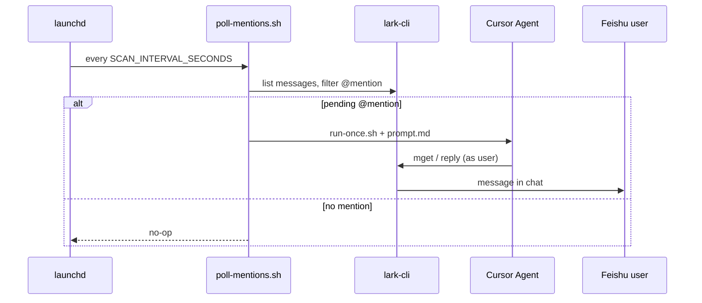

# Lark on-call agent

macOS **launchd** polls Feishu group chats with **lark-cli**. When an unhandled `@mention` appears in the configured window, **Cursor Agent CLI** runs once to analyze context (code, optional logs) and reply as **your Feishu user** — not a bot.

## Contents

| File | Role |
|------|------|
| `poll-mentions.sh` | Lightweight poll (lark-cli + jq only) |
| `run-once.sh` | Invokes Cursor Agent with runtime + `prompt.md` |
| `prompt.md` | Fixed agent instructions and safety boundaries |
| `env.example` | Configuration template (no secrets) |
| `install-launchd.sh` | Interactive LaunchAgent setup |
| `manage-launchd.sh` | List / start / stop / remove instances |
| `feishu-reply-markdown.sh` | Send Markdown replies as Feishu post |
| `setup-logs-permissions.sh` | Optional Cursor CLI allowlist for logs + lark-cli |
| `upgrade-to-plan-b.sh` | Migrate legacy 300s `run-once` jobs to poll-first |

## Prerequisites

```bash
cursor agent --help
cursor agent login
cursor agent status    # Logged in
lark-cli --help
jq --version
```

Feishu scopes (user identity):

```bash
lark-cli auth login --scope "im:chat:read im:message im:message.send_as_user im:message.group_msg:get_as_user im:message.p2p_msg:get_as_user contact:user.base:readonly"
```

## Quick install

```bash
cd /path/to/your/project
git clone git@github.com:solace20/lark-oncall-agent.git tools/lark-oncall-agent
chmod +x tools/lark-oncall-agent/*.sh tools/lark-oncall-agent/lib/*.sh
tools/lark-oncall-agent/install-launchd.sh
```

The installer configures workspace root, mention alias, chat names, poll interval, and writes `~/Library/LaunchAgents/com.local.lark-oncall-agent.<instance>.plist`.

## Configuration

Example `.env`:

```bash
MENTION_NAME=OnCall
WINDOW_MINUTES=3
SCAN_INTERVAL_SECONDS=60
REPLY_MODE=send
TARGET_CHAT_NAMES_JSON='["Engineering On-call","Platform Alerts"]'
```

First run:

```bash
REPLY_MODE=dry-run
```

Prefer `TARGET_CHAT_IDS_JSON` when chat IDs are known:

```bash
TARGET_CHAT_IDS_JSON='[{"name":"Engineering On-call","chat_id":"oc_xxx"}]'
```

Optional observability:

```bash
LOGS_CLIENT=/path/to/your/logs_client.py
```

Then run `setup-logs-permissions.sh` once.

## Architecture (Plan B)



## Manual commands

```bash
ENV_FILE=tools/lark-oncall-agent/.env.default tools/lark-oncall-agent/poll-mentions.sh
ENV_FILE=tools/lark-oncall-agent/.env.default tools/lark-oncall-agent/run-once.sh
tools/lark-oncall-agent/manage-launchd.sh list
tools/lark-oncall-agent/manage-launchd.sh logs default
```

## Idempotency and safety

Each instance keeps `handled_at_msg_ids.txt` (one `message_id` per successful reply). `prompt.md` forbids git destructive ops and production changes without human confirmation.

## License

MIT — see repository for terms. No credentials are stored in this repo; use `lark-cli auth` and local `.env.*` files (gitignored).
