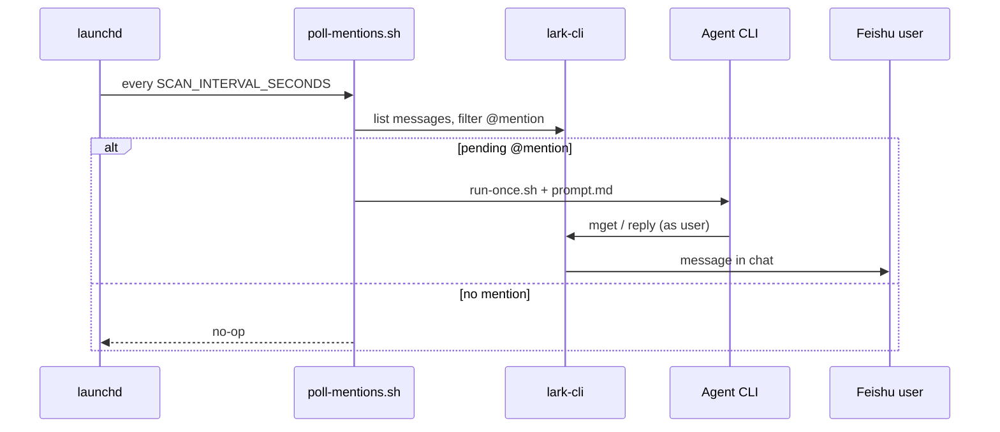

# Lark on-call agent / 飞书 @ 值守 Agent

[中文](#中文) · [English](#english)

---

## 中文

macOS **launchd** 通过 **lark-cli** 轮询飞书群消息。在配置的时间窗口内出现未处理的 `@mention` 时，启动 **Cursor Agent CLI** 或 **Claude Code** 分析上下文（代码、可选日志），并以**你的飞书用户身份**回复——不是机器人。

### 目录

| 文件 | 说明 |
|------|------|
| `poll-mentions.sh` | 轻量轮询（仅 lark-cli + jq） |
| `run-once.sh` | 调用 Cursor / Claude Code，注入运行时参数 + `prompt.md` |
| `prompt.md` | Agent 固定指令与安全边界 |
| `env.example` | 配置模板（不含密钥） |
| `install-launchd.sh` | 交互式 LaunchAgent 安装 |
| `manage-launchd.sh` | 列出 / 启停 / 卸载实例 |
| `feishu-reply-markdown.sh` | 以飞书 post 形式发送 Markdown 回复 |
| `setup-logs-permissions.sh` | 可选：日志 CLI + lark-cli 权限白名单（Cursor / Claude） |

### 前置条件

通过 `.env` 中的 `AGENT_BACKEND` 选择后端（默认 `cursor`，可选 `claude`）。

**Cursor：**

```bash
cursor agent --help
cursor agent login
cursor agent status    # 需 Logged in
```

**Claude Code：**

```bash
claude --help
claude auth login
claude auth status     # loggedIn 需为 true
```

**通用：**

```bash
lark-cli --help
jq --version
```

飞书用户授权（一次性）：

```bash
lark-cli auth login --scope "im:chat:read im:message im:message.send_as_user im:message.group_msg:get_as_user im:message.p2p_msg:get_as_user contact:user.base:readonly"
```

### 快速安装

```bash
cd /path/to/your/project
git clone git@github.com:solace20/lark-oncall-agent.git tools/lark-oncall-agent
chmod +x tools/lark-oncall-agent/*.sh tools/lark-oncall-agent/lib/*.sh
tools/lark-oncall-agent/install-launchd.sh
```

安装脚本会交互配置：Agent 后端、工作区根目录、@ 匹配花名、监听群名、轮询间隔，并写入 `~/Library/LaunchAgents/com.local.lark-oncall-agent.<instance>.plist`。

### 配置

`.env` 示例：

```bash
AGENT_BACKEND=claude
MENTION_NAME=OnCall
WINDOW_MINUTES=3
SCAN_INTERVAL_SECONDS=60
REPLY_MODE=send
TARGET_CHAT_NAMES_JSON='["Engineering On-call","Platform Alerts"]'

# Claude Code（AGENT_BACKEND=claude 时）
CLAUDE_SKIP_PERMISSIONS=true

# Cursor（AGENT_BACKEND=cursor 时）
CURSOR_FORCE=true
```

首次验证建议：

```bash
REPLY_MODE=dry-run
```

已知群 ID 时优先使用 `TARGET_CHAT_IDS_JSON`：

```bash
TARGET_CHAT_IDS_JSON='[{"name":"Engineering On-call","chat_id":"oc_xxx"}]'
```

可选日志集成：

```bash
LOGS_CLIENT=/path/to/your/logs_client.py
SETUP_BACKEND=both tools/lark-oncall-agent/setup-logs-permissions.sh
```

每个使用的后端各执行一次 `setup-logs-permissions.sh`。

### 架构



launchd 每 `SCAN_INTERVAL_SECONDS` 秒执行轻量轮询；只有发现未处理的 @ 时才调用完整 Agent，避免空跑。

### 手动命令

```bash
ENV_FILE=tools/lark-oncall-agent/.env.default tools/lark-oncall-agent/poll-mentions.sh
ENV_FILE=tools/lark-oncall-agent/.env.default tools/lark-oncall-agent/run-once.sh
tools/lark-oncall-agent/manage-launchd.sh list
tools/lark-oncall-agent/manage-launchd.sh logs default
```

### 幂等与安全

每个实例维护 `handled_at_msg_ids.txt`（成功回复后记录 `message_id`，避免重复处理）。`prompt.md` 禁止 git 破坏性操作及未经确认的生产变更。

### 许可证

MIT — 详见仓库说明。本仓库不存储凭证；请使用 `lark-cli auth` 与本地 `.env.*` 文件（已 gitignore）。

---

## English

macOS **launchd** polls Feishu group chats with **lark-cli**. When an unhandled `@mention` appears in the configured window, **Cursor Agent CLI** or **Claude Code** runs once to analyze context (code, optional logs) and reply as **your Feishu user** — not a bot.

### Contents

| File | Role |
|------|------|
| `poll-mentions.sh` | Lightweight poll (lark-cli + jq only) |
| `run-once.sh` | Invokes Cursor or Claude Code with runtime + `prompt.md` |
| `prompt.md` | Fixed agent instructions and safety boundaries |
| `env.example` | Configuration template (no secrets) |
| `install-launchd.sh` | Interactive LaunchAgent setup |
| `manage-launchd.sh` | List / start / stop / remove instances |
| `feishu-reply-markdown.sh` | Send Markdown replies as Feishu post |
| `setup-logs-permissions.sh` | Optional allowlist for logs + lark-cli (Cursor and/or Claude) |

### Prerequisites

Choose one backend via `AGENT_BACKEND` in `.env` (`cursor` default, or `claude`).

**Cursor:**

```bash
cursor agent --help
cursor agent login
cursor agent status    # Logged in
```

**Claude Code:**

```bash
claude --help
claude auth login
claude auth status     # loggedIn: true
```

**Common:**

```bash
lark-cli --help
jq --version
```

Feishu scopes (user identity):

```bash
lark-cli auth login --scope "im:chat:read im:message im:message.send_as_user im:message.group_msg:get_as_user im:message.p2p_msg:get_as_user contact:user.base:readonly"
```

### Quick install

```bash
cd /path/to/your/project
git clone git@github.com:solace20/lark-oncall-agent.git tools/lark-oncall-agent
chmod +x tools/lark-oncall-agent/*.sh tools/lark-oncall-agent/lib/*.sh
tools/lark-oncall-agent/install-launchd.sh
```

The installer configures agent backend, workspace root, mention alias, chat names, poll interval, and writes `~/Library/LaunchAgents/com.local.lark-oncall-agent.<instance>.plist`.

### Configuration

Example `.env`:

```bash
AGENT_BACKEND=claude
MENTION_NAME=OnCall
WINDOW_MINUTES=3
SCAN_INTERVAL_SECONDS=60
REPLY_MODE=send
TARGET_CHAT_NAMES_JSON='["Engineering On-call","Platform Alerts"]'

# Claude Code (when AGENT_BACKEND=claude)
CLAUDE_SKIP_PERMISSIONS=true

# Cursor (when AGENT_BACKEND=cursor)
CURSOR_FORCE=true
```

First run:

```bash
REPLY_MODE=dry-run
```

Prefer `TARGET_CHAT_IDS_JSON` when chat IDs are known:

```bash
TARGET_CHAT_IDS_JSON='[{"name":"Engineering On-call","chat_id":"oc_xxx"}]'
```

Optional observability:

```bash
LOGS_CLIENT=/path/to/your/logs_client.py
SETUP_BACKEND=both tools/lark-oncall-agent/setup-logs-permissions.sh
```

Run `setup-logs-permissions.sh` once per backend you use.

### Architecture


launchd runs a lightweight poll every `SCAN_INTERVAL_SECONDS`; the full agent starts only when a pending @mention is found.

### Manual commands

```bash
ENV_FILE=tools/lark-oncall-agent/.env.default tools/lark-oncall-agent/poll-mentions.sh
ENV_FILE=tools/lark-oncall-agent/.env.default tools/lark-oncall-agent/run-once.sh
tools/lark-oncall-agent/manage-launchd.sh list
tools/lark-oncall-agent/manage-launchd.sh logs default
```

### Idempotency and safety

Each instance keeps `handled_at_msg_ids.txt` (one `message_id` per successful reply). `prompt.md` forbids git destructive ops and production changes without human confirmation.

### License

MIT — see repository for terms. No credentials are stored in this repo; use `lark-cli auth` and local `.env.*` files (gitignored).
